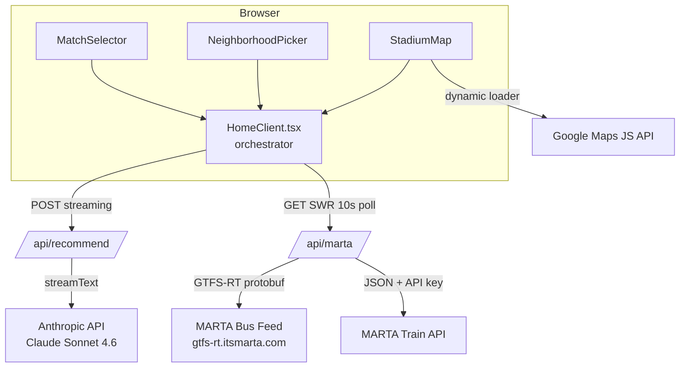

# Technical Specification: Match Day ATL v2

**Document type:** Engineering Specification  
**Status:** Final — v2.0  
**Author:** Drew Schillinger (DoctorEw)  
**PRD Reference:** [PRD.md](./PRD.md)  
**Last updated:** 2026-04-11

---

## 1. Overview

Match Day ATL is a Next.js 16 (App Router) web application that provides real-time, AI-assisted MARTA transit recommendations for FIFA World Cup 2026 fans. It integrates three external data sources — the Anthropic Claude API, the MARTA GTFS-RT feed, and the Google Maps JavaScript API — and wraps all of them with graceful fallbacks so the app remains usable when any service is degraded.

This document covers architecture, data models, API contracts, state management, error handling, environment configuration, and testing strategy.

---

## 2. System Architecture



### Rendering Model

| Layer | Strategy | Reason |
|-------|----------|--------|
| `app/page.tsx` | Server Component (async) | SSR shell — loads match data at request time, no client JS |
| `HomeClient.tsx` | Client Component | Drives all interactive state |
| `/api/recommend` | Route Handler (streaming) | Streams AI tokens as they arrive |
| `/api/marta` | Route Handler (JSON) | Fetches + normalizes transit data server-side to hide API keys |

The separation keeps API keys out of the client bundle: `ANTHROPIC_API_KEY` and `MARTA_TRAIN_API_KEY` are only accessed inside route handlers, never in client components.

---

## 3. Data Models

### 3a. `Match`

Defined in `src/lib/schemas.ts` via Zod; the inferred TypeScript type is used everywhere.

```typescript
type Match = {
  match_id: string;      // e.g., "atl-01"
  team_a: string;        // e.g., "USA" | "TBD"
  team_b: string;
  kickoff_utc: string;   // ISO 8601, e.g., "2026-06-14T23:00:00Z"
  stage: string;         // "Group Stage" | "Round of 16" | "Quarterfinal"
  group: string | null;  // "C" | "D" | ... | null for knockout rounds
};
```

**Source:** `public/matches.json` — static JSON loaded at SSR time by `page.tsx` and validated against `MatchArraySchema` before render. Build-time validation via `scripts/validate-matches.ts`.

### 3b. `Zone`

```typescript
type Zone = "Downtown" | "Midtown" | "Airport";
```

Represents the fan's starting neighborhood. Used as a key into the AI prompt template and fallback response map.

### 3c. `TransitVehicle`

Defined in `src/lib/types.ts`. Returned by `/api/marta` and consumed by `TransitMarkers.tsx`.

```typescript
interface TransitVehicle {
  id: string;
  type: "bus" | "train";
  latitude: number;
  longitude: number;
  route: string;         // e.g., "Gold", "110"
}
```

### 3d. `RecommendRequest`

The validated body shape for `POST /api/recommend`.

```typescript
type RecommendRequest = {
  zone: Zone;
  match: Match;
  injectDelay: boolean;  // true triggers delay simulation in prompt context
};
```

### 3e. `TrainArrival` (internal — `src/lib/marta.ts`)

Used only inside `/api/marta` to parse the MARTA train JSON feed before normalizing to `TransitVehicle`.

```typescript
interface TrainArrival {
  STATION: string;
  LINE: string;         // "Gold", "Blue", "Red", "Green"
  DIRECTION: string;    // "N" | "S" | "E" | "W"
  WAITING_SECONDS: number;
  TRAIN_ID: string;
}
```

---

## 4. API Contracts

### 4a. `POST /api/recommend`

**Purpose:** Stream a conversational routing recommendation from Claude.

**Request**
```
Content-Type: application/json

{
  "zone": "Midtown",
  "match": {
    "match_id": "atl-02",
    "team_a": "Argentina",
    "team_b": "Chile",
    "kickoff_utc": "2026-06-19T23:00:00Z",
    "stage": "Group Stage",
    "group": "D"
  },
  "injectDelay": false
}
```

**Response (success — streaming)**
```
Content-Type: text/plain; charset=utf-8
Transfer-Encoding: chunked

Head to Arts Center station on the Red/Gold Line — it's...
```

Tokens are streamed via the Vercel AI SDK `streamText` response. The client reads the stream and appends tokens to the `recommendation` state variable as they arrive.

**Response (fallback — non-streaming)**

When the Claude call times out (> 8s) or throws, the route returns a static string from `FALLBACK_RESPONSES[zone]` with status 200. The caller cannot distinguish fallback from live — this is intentional.

**Response (validation error)**
```
Status: 400
Content-Type: application/json

{ "error": "Invalid request body", "details": [...] }
```

**Kill switch:** `USE_MOCK_CLAUDE=true` → returns fallback immediately without calling Claude.

---

### 4b. `GET /api/marta`

**Purpose:** Fetch and normalize live MARTA vehicle positions.

**Request:** No body. Optional query param: `?inject_delay=gold_line`

**Response (success)**
```json
{
  "vehicles": [
    {
      "id": "train-1042",
      "type": "train",
      "latitude": 33.7490,
      "longitude": -84.3880,
      "route": "Gold"
    },
    {
      "id": "bus-110-5523",
      "type": "bus",
      "latitude": 33.7531,
      "longitude": -84.3912,
      "route": "110"
    }
  ],
  "hasDelay": false,
  "delayLine": null
}
```

**Response (delay active)**
```json
{
  "vehicles": [...],
  "hasDelay": true,
  "delayLine": "gold_line"
}
```

**Response (data unavailable — fallback)**

Returns mock vehicles with `"hasDelay": false`. Status 200. The mock set includes representative bus and train positions near the stadium so the map isn't empty.

**Kill switch:** `USE_MOCK_MARTA_DATA=true` → always returns mock data.

**Cache behavior:** No caching headers set; SWR on the client controls refresh cadence (10s interval, 5s dedup window).

---

## 5. Component Inventory

| Component | Type | Responsibility |
|-----------|------|----------------|
| `app/page.tsx` | Server | Loads + validates `matches.json`; renders `HomeClient` with match data prop |
| `HomeClient.tsx` | Client | Orchestrates all state; calls `/api/recommend` on user action |
| `MatchSelector.tsx` | Client | Renders match list; formats kickoff to Eastern Time |
| `NeighborhoodPicker.tsx` | Client | Radio button zone selector; emits selected `Zone` |
| `StadiumMap.tsx` | Client | Loads Google Maps; renders stadium marker, traffic layer, user location |
| `TransitMarkers.tsx` | Client | Renders and animates `TransitVehicle` markers on the map |
| `RecommendationCard.tsx` | Client | Displays streaming AI text; shows loading skeleton |
| `DelayBadge.tsx` | Client | Renders delay banner when `hasDelay: true` from MARTA data |

### Component State Flow

```
HomeClient (owns all state)
  ├── selectedMatch: Match | null
  ├── zone: Zone | null
  ├── recommendation: string
  ├── isLoading: boolean
  └── martaData: { vehicles, hasDelay, delayLine } (via useMartaData)

User selects match + zone
  → handleGenerate() called
  → POST /api/recommend (streams)
  → tokens appended to `recommendation` as they arrive
  → isLoading set false on stream end or error
```

---

## 6. Hooks

### `useMartaData` (`src/hooks/useMartaData.ts`)

SWR-based hook that polls `/api/marta` on a 10-second interval.

```typescript
function useMartaData(): {
  vehicles: TransitVehicle[];
  hasDelay: boolean;
  delayLine: string | null;
  isLoading: boolean;
  error: Error | undefined;
}
```

**SWR config:**
- `refreshInterval: 10_000`
- `dedupingInterval: 5_000`
- `errorRetryCount: 3`
- `revalidateOnFocus: false` (prevents burst on tab-switch during match day)

---

## 7. AI Integration

### Model
- Provider: Anthropic via `@ai-sdk/anthropic`
- Model: `claude-sonnet-4-6`
- SDK: Vercel AI SDK v6 (`streamText`)

### System Prompt Template

```
You are a local Atlanta friend who knows MARTA well.
Give the fan a short, friendly recommendation in 3 sentences or fewer.
No bullet points. No transit jargon. Talk like you're texting a friend.
```

### User Prompt Template

The prompt is assembled in `/api/recommend/route.ts` using this structure:

```
A fan is going to [STAGE]: [TEAM_A] vs. [TEAM_B] at Mercedes-Benz Stadium.
Kickoff is at [LOCAL_TIME] Eastern Time.
They are starting from [ZONE].
[IF DELAY]: Note: The [DELAY_LINE] line is currently experiencing delays.
How should they get there using MARTA?
```

The model output is streamed directly to the client. No post-processing.

### Timeout & Fallback

```typescript
// Abort signal passed to streamText
const controller = new AbortController();
const timeout = setTimeout(() => controller.abort(), 8_000);

try {
  const result = await streamText({ ..., abortSignal: controller.signal });
  return result.toTextStreamResponse();
} catch {
  return new Response(FALLBACK_RESPONSES[zone], { status: 200 });
} finally {
  clearTimeout(timeout);
}
```

---

## 8. MARTA Data Integration

### Bus Data
- **Source:** MARTA GTFS-RT Vehicle Positions feed (`gtfs-rt.itsmarta.com`)
- **Format:** Protocol Buffers, decoded via `gtfs-realtime-bindings`
- **Filtered to:** Vehicles with valid position data (lat/lng present)
- **Timeout:** 10s `AbortController`

### Train Data
- **Source:** MARTA Train API (JSON)
- **Auth:** `MARTA_TRAIN_API_KEY` header
- **Parsed via:** `TrainArrival` interface → normalized to `TransitVehicle`
- **Delay detection:** Any `TrainArrival` with `LINE === "Gold"` and `WAITING_SECONDS > 300` triggers `hasDelay: true`

### Fallback Mock Data

Defined inline in `/api/marta/route.ts`. Includes ~6 representative vehicles positioned near the stadium and on the Gold/Blue lines. Returned on any fetch error or when `USE_MOCK_MARTA_DATA=true`.

---

## 9. Environment Variables

| Variable | Required | Scope | Description |
|----------|----------|-------|-------------|
| `ANTHROPIC_API_KEY` | Yes | Server | Claude API authentication |
| `MARTA_TRAIN_API_KEY` | Yes | Server | MARTA train JSON feed |
| `NEXT_PUBLIC_GOOGLE_MAPS_API_KEY` | Yes | Client | Google Maps JS API |
| `NEXT_PUBLIC_STADIUM_NAME` | No | Client | Display name; default `"Mercedes-Benz Stadium"` |
| `NEXT_PUBLIC_STADIUM_LAT` | No | Client | Map center; default `33.754542` |
| `NEXT_PUBLIC_STADIUM_LNG` | No | Client | Map center; default `-84.402492` |
| `USE_MOCK_CLAUDE` | No | Server | `"true"` skips Claude; returns fallback |
| `USE_MOCK_MARTA_DATA` | No | Server | `"true"` skips MARTA API; returns mock |

**Rule:** Only values the browser legitimately needs carry the `NEXT_PUBLIC_` prefix. API credentials are never exposed to the client.

---

## 10. Error Handling Strategy

The app follows a "degrade gracefully, never block" model:

| Failure | User Experience | Implementation |
|---------|----------------|----------------|
| Claude API down | Receives fallback response; no error UI | Catch + return `FALLBACK_RESPONSES[zone]` |
| Claude timeout (> 8s) | Same as above | `AbortController` + catch |
| MARTA bus feed down | Map shows trains only (or mock) | Independent try/catch per data source |
| MARTA train feed down | Map shows buses only (or mock) | Independent try/catch per data source |
| Both MARTA feeds down | Map loads with mock vehicles | Outer catch returns mock set |
| Google Maps key invalid | Map area blank; rest of app functional | `@googlemaps/js-api-loader` error handled in `StadiumMap` |
| Geolocation denied | No user pin shown; silent | `navigator.geolocation` wrapped in try/catch |
| `matches.json` malformed | Build fails at validation step | `validate-matches.ts` exits 1 |
| Network offline | Fallback recommendations still readable | Pre-baked responses require no network |

No user-visible error states exist for external API failures. Errors are logged server-side.

---

## 11. Styling System

**Framework:** Tailwind CSS v4 (PostCSS plugin)

**Design tokens** (CSS custom properties in `globals.css`):

| Token | Purpose |
|-------|---------|
| `--bg` | Page background |
| `--surface` | Card / panel background |
| `--border` | Dividers, card borders |
| `--accent` | CTA buttons, active selection |
| `--text` | Primary text |
| `--delay` | Delay banner background (amber) |
| `--error` | Error state text (unused in normal flow) |

Dark mode via `@media (prefers-color-scheme: dark)` — all tokens remapped, no JS involved.

**Layout:** Flexbox. On desktop: left sidebar (match/zone/recommendation) + right full-height map. On mobile (< 768px): sidebar stacks above map.

---

## 12. Testing Strategy

**Framework:** Vitest + React Testing Library + jsdom

### Test Scope (v2)

| Category | What to Test | What NOT to Test |
|----------|-------------|-----------------|
| Schema validation | `MatchSchema`, `RecommendRequest`, `MatchArraySchema` | Implementation details of Zod |
| `validate-matches.ts` | Script exits 0 on valid JSON, 1 on invalid | File I/O internals |
| `useMartaData` hook | SWR state transitions (loading → data → error) | Actual MARTA network calls |
| `NeighborhoodPicker` | Emits correct zone on click; keyboard nav | CSS rendering |
| `MatchSelector` | Renders match list; formats time correctly; selection callback fires | Internal React state |
| `RecommendationCard` | Shows skeleton while `isLoading`; renders text when done | Stream parsing |
| `/api/marta` route | Returns `hasDelay: true` when delay injected; falls back on error | GTFS protobuf decoding |
| `/api/recommend` route | Returns fallback on timeout; validates request body; rejects bad zone | Claude streaming internals |

**Environment variables in tests:** All external API calls are gated by `USE_MOCK_CLAUDE=true` and `USE_MOCK_MARTA_DATA=true` in the test environment. No real network calls in CI.

**Run commands:**
```bash
bun run test          # single run
bun run test:watch    # watch mode
```

---

## 13. Performance Targets

| Metric | Target | How Achieved |
|--------|--------|-------------|
| LCP (mobile, 4G) | < 2.5s | SSR shell; map loaded async; no render-blocking scripts |
| First AI token | < 1.5s | Streaming response; `RecommendationCard` renders tokens as received |
| MARTA data age | ≤ 15s | SWR 10s interval + 5s dedup |
| JS bundle (client) | < 200KB gzip | App Router code-splitting; Google Maps loaded via dynamic loader, not bundled |
| Cold start (route handlers) | < 500ms | No database; stateless handlers; Fluid Compute on Vercel |

---

## 14. Security Considerations

- **API key exposure:** All sensitive keys accessed only in route handlers (server-side). `NEXT_PUBLIC_GOOGLE_MAPS_API_KEY` is client-exposed by design but should be domain-restricted in the Google Cloud Console.
- **Input validation:** All incoming request bodies validated with Zod before processing. Invalid requests return 400 without touching downstream APIs.
- **Prompt injection:** The AI prompt is assembled from a closed set of values (zone enum, match fields from validated JSON). No user-supplied free-text is interpolated into the system or user prompt.
- **No auth surface:** The app has no authentication, accounts, or session management. No PII is collected or stored.
- **CORS:** Next.js route handlers default to same-origin. No cross-origin access needed.

---

## 15. Deployment

**Platform:** Vercel (Fluid Compute — default Node.js runtime)

**Environment variable management:** `vercel env` CLI or Vercel dashboard. Never committed to the repository.

**Build process:**
1. `bun run build` → Next.js production build
2. `validate-matches.ts` runs as a prebuild check
3. Static assets (`public/matches.json`, icons) served from CDN edge
4. Route handlers deployed as Vercel Functions (Node.js 24)

**Recommended Vercel project settings:**
- Framework: Next.js (auto-detected)
- Build command: `bun run build`
- Install command: `bun install`
- Function region: `iad1` (US East — closest to Atlanta with lowest MARTA API latency)

---

## Appendix A: Dependency Rationale

| Package | Why This One |
|---------|-------------|
| `ai` (Vercel AI SDK v6) | Native streaming support; provider-agnostic; works without extra boilerplate for token streaming to the browser |
| `@ai-sdk/anthropic` | Official Anthropic provider for the AI SDK; keeps switching providers easy |
| `swr` | Minimal, proven data-fetching hook with built-in polling, dedup, and retry — no Redux overhead |
| `gtfs-realtime-bindings` | Only library that decodes MARTA's protobuf GTFS-RT feed correctly in Node.js |
| `zod` v4 | Runtime validation with inferred TypeScript types; eliminates a whole class of type/runtime drift bugs |
| `next-intl` | i18n infrastructure with minimal overhead; wired now so adding Spanish/Portuguese later is a config change, not a refactor |

---

## Appendix B: File Map

```
src/
├── app/
│   ├── page.tsx                  # SSR entry — loads matches, renders HomeClient
│   ├── layout.tsx                # Root layout, metadata, Inter font
│   ├── HomeClient.tsx            # All interactive state + orchestration
│   ├── globals.css               # Design tokens + Tailwind base
│   └── api/
│       ├── recommend/route.ts    # POST — streaming AI recommendation
│       └── marta/route.ts        # GET — MARTA vehicle positions + delay status
├── components/
│   ├── StadiumMap.tsx            # Google Map wrapper
│   ├── TransitMarkers.tsx        # Animated vehicle markers
│   ├── NeighborhoodPicker.tsx    # Zone radio selector
│   ├── MatchSelector.tsx         # Match list
│   ├── RecommendationCard.tsx    # Streaming text display
│   └── DelayBadge.tsx            # Delay notice banner
├── hooks/
│   └── useMartaData.ts           # SWR polling hook
├── lib/
│   ├── types.ts                  # TransitVehicle interface
│   ├── schemas.ts                # Zod schemas (Match, RecommendRequest, MatchArray)
│   ├── marta.ts                  # MARTA API helpers + TrainArrival type
│   └── fallbacks.ts              # Pre-baked responses keyed by Zone
├── test/
│   └── setup.ts                  # Vitest + jsdom + Testing Library config
└── i18n/                         # Placeholder for next-intl message files

public/
└── matches.json                  # Static match schedule (8 matches)

scripts/
└── validate-matches.ts           # Build-time schema validation for matches.json
```
